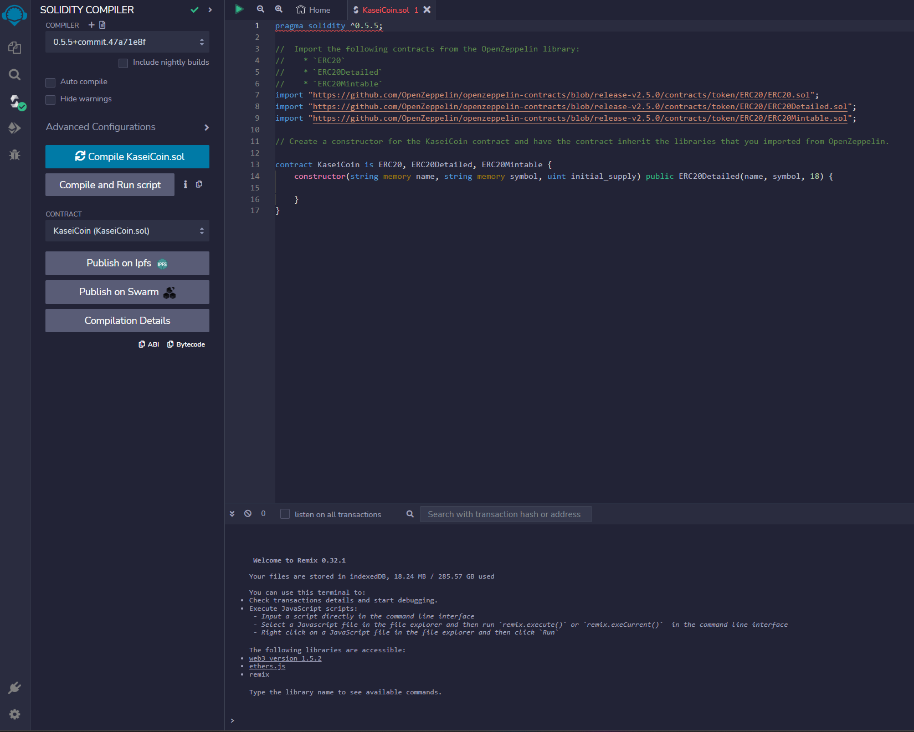
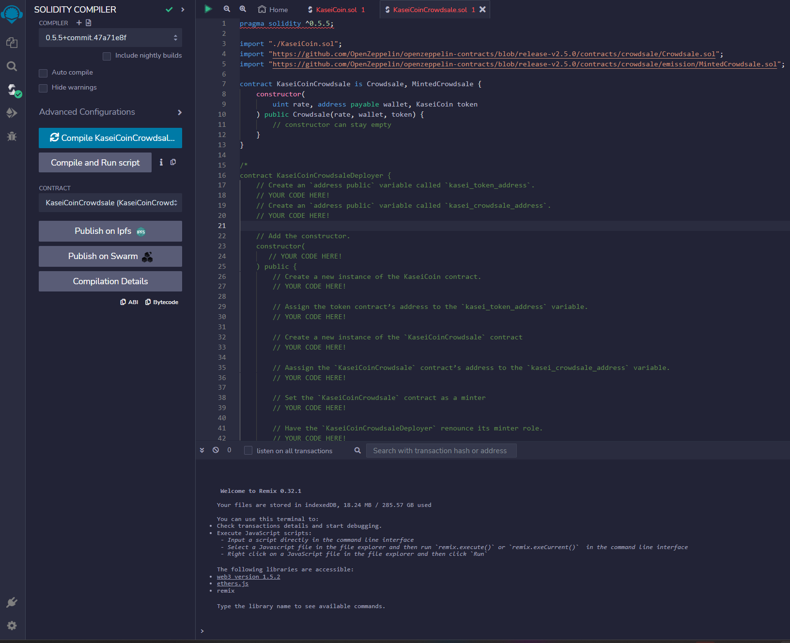
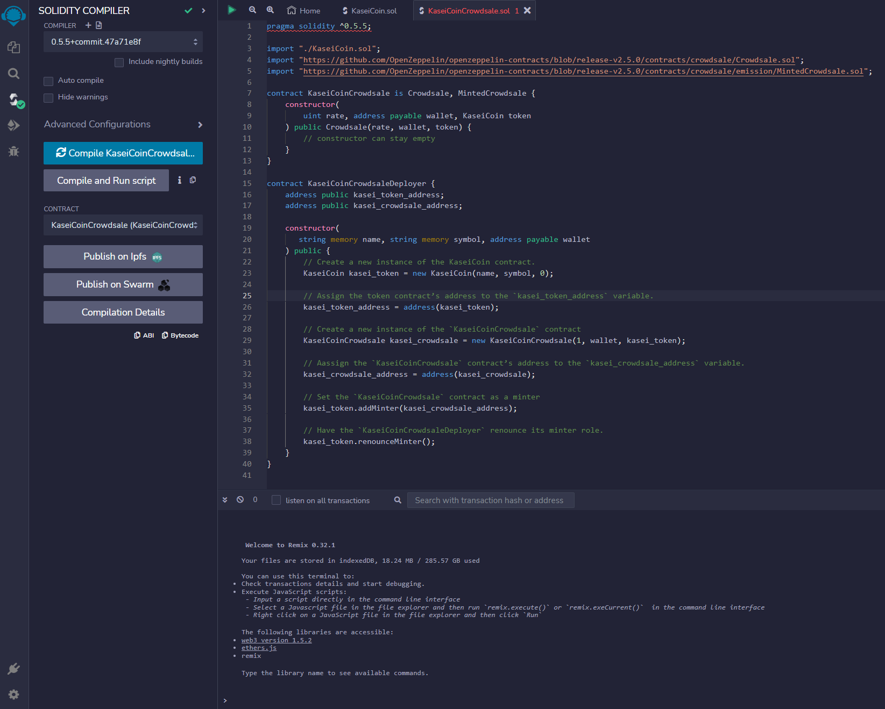

# KaseiCoin

After waiting for years and passing several tests, the Martian Aerospace Agency (a fictitious organization) is sending the first human colony on Mars. As a prominent fintech professional, we're leading a project developing a monetary system for the new colony. this new system is based on blockchain technology and defining a new cryptocurrency, named KaseiCoin. (Kasei means Mars in Japanese.)

KaseiCoin is a fungible token that’s ERC-20 compliant and that will get minted via a crowdsale contract from the Solidity library.

